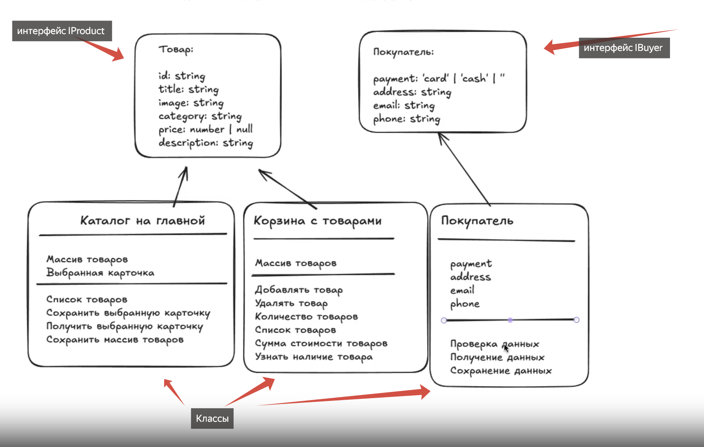

# Проектная работа "Веб-ларек"

Стек: HTML, SCSS, TS, Vite

Структура проекта:

- src/ — исходные файлы проекта
- src/components/ — папка с JS компонентами
- src/components/base/ — папка с базовым кодом

Важные файлы:

- index.html — HTML-файл главной страницы
- src/types/index.ts — файл с типами
- src/main.ts — точка входа приложения
- src/scss/styles.scss — корневой файл стилей
- src/utils/constants.ts — файл с константами
- src/utils/utils.ts — файл с утилитами

## Установка и запуск

Для установки и запуска проекта необходимо выполнить команды

```
npm install
npm run dev
```

или

```
yarn
yarn dev
```

## Сборка

```
npm run build
```

или

```
yarn build
```

# Интернет-магазин «Web-Larёk»

«Web-Larёk» — это интернет-магазин с товарами для веб-разработчиков, где пользователи могут просматривать товары, добавлять их в корзину и оформлять заказы. Сайт предоставляет удобный интерфейс с модальными окнами для просмотра деталей товаров, управления корзиной и выбора способа оплаты, обеспечивая полный цикл покупки с отправкой заказов на сервер.

## Архитектура приложения

Код приложения разделен на слои согласно парадигме MVP (Model-View-Presenter), которая обеспечивает четкое разделение ответственности между классами слоев Model и View. Каждый слой несет свой смысл и ответственность:

Model - слой данных, отвечает за хранение и изменение данных.  
View - слой представления, отвечает за отображение данных на странице.  
Presenter - презентер содержит основную логику приложения и отвечает за связь представления и данных.

Взаимодействие между классами обеспечивается использованием событийно-ориентированного подхода. Модели и Представления генерируют события при изменении данных или взаимодействии пользователя с приложением, а Презентер обрабатывает эти события используя методы как Моделей, так и Представлений.

### Базовый код

#### Класс Component

Является базовым классом для всех компонентов интерфейса.
Класс является дженериком и принимает в переменной `T` тип данных, которые могут быть переданы в метод `render` для отображения.

Конструктор:  
`constructor(container: HTMLElement)` - принимает ссылку на DOM элемент за отображение, которого он отвечает.

Поля класса:  
`container: HTMLElement` - поле для хранения корневого DOM элемента компонента.

Методы класса:  
`render(data?: Partial<T>): HTMLElement` - Главный метод класса. Он принимает данные, которые необходимо отобразить в интерфейсе, записывает эти данные в поля класса и возвращает ссылку на DOM-элемент. Предполагается, что в классах, которые будут наследоваться от `Component` будут реализованы сеттеры для полей с данными, которые будут вызываться в момент вызова `render` и записывать данные в необходимые DOM элементы.  
`setImage(element: HTMLImageElement, src: string, alt?: string): void` - утилитарный метод для модификации DOM-элементов ``

#### Класс Api

Содержит в себе базовую логику отправки запросов.

Конструктор:  
`constructor(baseUrl: string, options: RequestInit = {})` - В конструктор передается базовый адрес сервера и опциональный объект с заголовками запросов.

Поля класса:  
`baseUrl: string` - базовый адрес сервера  
`options: RequestInit` - объект с заголовками, которые будут использованы для запросов.

Методы:  
`get(uri: string): Promise<object>` - выполняет GET запрос на переданный в параметрах ендпоинт и возвращает промис с объектом, которым ответил сервер  
`post(uri: string, data: object, method: ApiPostMethods = 'POST'): Promise<object>` - принимает объект с данными, которые будут переданы в JSON в теле запроса, и отправляет эти данные на ендпоинт переданный как параметр при вызове метода. По умолчанию выполняется `POST` запрос, но метод запроса может быть переопределен заданием третьего параметра при вызове.  
`handleResponse(response: Response): Promise<object>` - защищенный метод проверяющий ответ сервера на корректность и возвращающий объект с данными полученный от сервера или отклоненный промис, в случае некорректных данных.

#### Класс EventEmitter

Брокер событий реализует паттерн "Наблюдатель", позволяющий отправлять события и подписываться на события, происходящие в системе. Класс используется для связи слоя данных и представления.

Конструктор класса не принимает параметров.

Поля класса:  
`_events: Map<string | RegExp, Set<Function>>)` - хранит коллекцию подписок на события. Ключи коллекции - названия событий или регулярное выражение, значения - коллекция функций обработчиков, которые будут вызваны при срабатывании события.

Методы класса:  
`on<T extends object>(event: EventName, callback: (data: T) => void): void` - подписка на событие, принимает название события и функцию обработчик.  
`emit<T extends object>(event: string, data?: T): void` - инициализация события. При вызове события в метод передается название события и объект с данными, который будет использован как аргумент для вызова обработчика.  
`trigger<T extends object>(event: string, context?: Partial<T>): (data: T) => void` - возвращает функцию, при вызове которой инициализируется требуемое в параметрах событие с передачей в него данных из второго параметра.

---

## Данные

В ходе анализа проекта установлено : в приложении используются две сущности, которые описывают данные - товар и покупатель. Они описаны интерфейсами - как контрактные определения сущностей предметной области, описывающие неизменяемую структуру данных без привязки к логике обработки.



### Базовые типы

#### Тип TPayment (вид оплаты)

`export type TPayment = 'card' | 'cash'| ''` - описывает допустимые способы оплаты. Гарантирует, что в данных покупателя будет только одно из разрешенных значений.

### Интерфейсы сущностей

#### Интерфейс IProduct (товар)

Описывает структуру данных товара.

```ts
export interface IProduct {
  id: string; // Уникальный идентификатор (нужен для поиска)
  description: string; // Описание товара
  image: string; // Ссылка на изображение (обязательно для отображения)
  title: string; // Название товара (обязательно для карточки)
  category: string; // Категория товара
  price: number | null; // Цена: может отсутствовать (null)
}
```

Назначение:
-гарантирует, что у каждого товара есть уникальный ID, название и изображение для отображения.
-явно учитывает ситуацию, когда цена еще не установлена (значение null), предотвращая ошибки в расчетах.
-обеспечивает типобезопасность при передаче данных между слоями и при работе с массивами товаров.

#### Интерфейс IBuyer (покупатель)

Описывает структуру данных покупателя для оформления заказа.

```ts
export interface IBuyer {
  payment: TPayment; // способ оплаты: 'card' | 'cash'
  email: string;
  phone: string;
  address: string;
}
```

Назначение:
-фиксирует строгий набор полей, необходимых для формления заказа. (email, address, phone, payment)
-исключает передачу лишних данных ( например password).
-позволяет реализовать валидацию каждого поля и возвращать ошибки по конкретным ключам

### Модели данных

Для учета данных в приложении должны быть три класса, которые разделены между собой по смыслу и зонам ответственности:
-хранение товаров, которые можно купить в приложении. (Каталог товаров)
-хранение товаров, которые пользователь выбрал для покупки. (Корзина)
-данные покупателя, которые тот должен указать при оформлении заказа. (Покупатель)

#### Класс Products (Каталог товаров)

`export class Products {}` - Класс отвечает за хранение и управление коллекцией товаров каталога, а также состоянием выбранного товара для модального окна.

Конструктор класса:
Отсутствует и не принимает параметров. Внутренние поля инициализируются при объявлении: `private items` — пустым массивом, `private selectedItem` — значением null.
Это позволяет создавать экземпляр класса без аргументов и сразу использовать все методы.

Поля класса:
`private items: IProduct[]` - хранит массив всех товаров.
`private selectedItem: IProduct | null` - хранит товар, выбранный для подробного отображения (по умолчанию null; значение null - значит модальное окно закрыто).

Методы класса:
`setItems(items: IProduct[]) : void` - сохранение массива товаров полученного в параметрах метода. Принимает массив всех товаров, заменяет текущее содержимое поля `items`.
`getItems(): IProduct[]` - возвращает текущий массив товаров из модели для отрисовки каталога.
`getItemById(id: string): IProduct | undefined` - получение одного товара по его идентификатору (id). Принимает строку с идентификатором товара. Возвращает объект `IProduct` или undefined - если товар не найден.
`setSelectedItem(item: IProduct | null) : void` - сохранение товара для подробного отображения. Устанавливает товар в состояние "выбранного" для открытия модального окна. Принимает объект типа `IProduct`. Если передан null - модальное окно считается закрытым.
`getSelectedItem() : IProduct | null` - получение товара для подробного отображения. Возвращает выбранный товар или null - если ничего не выбрано.

#### Класс Cart (Корзина)

`export class Cart {}` - Класс отвечает за управление списком товаров в корзине, подсчет количества и общей стоимости.

Конструктор класса:
Отсутствует, и не принимает параметров. Корзина изначально пуста, поэтому поле `items` инициализируется пустым массивом при объявлении. Конструктор не нужен: экземпляр создаётся простым вызовом `new Cart()`.

Поля класса:
`private items : IProduct[]` - хранит массив товаров, которые находятся в корзине.

Методы класса:
`getItems() : IProduct[]` - получение массива товаров, которые находятся в корзине.
`addItem(item: IProduct) : void` - добавление товара в массив корзины. Принимает в качестве параметра - объект товара. Предотвращает дублирование по id. Проверяет наличие товара по id, если товара нет - добавляет его.
`removeItem(id : string) : void` - удаление товара из корзины. Принимает в качестве параметра строку с идентификатором товара.
`clear() : void` - полностью очищает корзину (используется после успешного оформления заказа).
`getTotalPrice() : number` - получение стоимости всех товаров в корзине. Возвращает число (сумма цен). Корректно обрабатывает товары с `price: null`, считая их стоимость как 0.
`getCount() : number` - получение количества товаров в корзине (для счетчика на иконке корзины). Возвращает целое число.
`hasItem(id: string) : boolean` - проверка наличия товара в корзине по его id. Принимает в качестве параметра строку с идентификатором товара. Возвращает true - если товар есть, false - если нет.

#### Класс Buyer (Покупатель)

`export class Buyer {}` - Класс отвечает за хранение, частичное обновление и валидацию данных покупателя перед оформлением заказа.

Конструктор класса:
Отсутствует и не принимает параметров. Начальное состояние объекта `data` задаётся при объявлении поля. Значение по умолчанию для способа оплаты — пустая строка (`payment: ''`), чтобы соответствовать состоянию UI, где кнопки выбора оплаты изначально неактивны. Остальные поля инициализируются пустыми строками. Сброс до этого состояния реализован отдельным методом `clear()`.

Поля класса:
`private data: IBuyer` - объект с текущими данными покупателя. По умолчанию: `{payment: '', address: '', phone: '', email: ''}`

Методы класса:
`setData(partialData: Partial<IBuyer>) : void` - сохранение данных в модели. Обновляет только переданные поля, не затрагивая остальные. Параметры: `partialData` - объект, содержащий любое подмножество полей `IBuyer`. Использует `Object.assign` для частичного обновления `data`.
`getData() : IBuyer` - получение всех данных покупателя. Возвращает полный объект данных покупателя в строгом формате `IBuyer`.
`clear() : void` - очистка данных покупателя. Сбрасывает все даннные покупателя в начальное состояние (используется после успешной отправки заказа).
` validate() : Partial<Record<keyof IBuyer, string>>` - выполняет валидацию полей (поле валидно если не пустое). Метод создает и возвращает объект с ошибками вида `{payment: 'Не выбран тип оплаты', email: 'Укажите email'}`, где ключи - названия полей IBuyer. Проверяет каждое поле на непустоту и формирует сообщения об ошибках по ключам интерфейса `IBuyer`. Возвращает пустой объект {} - если все поля валидны и ошибок нет.
